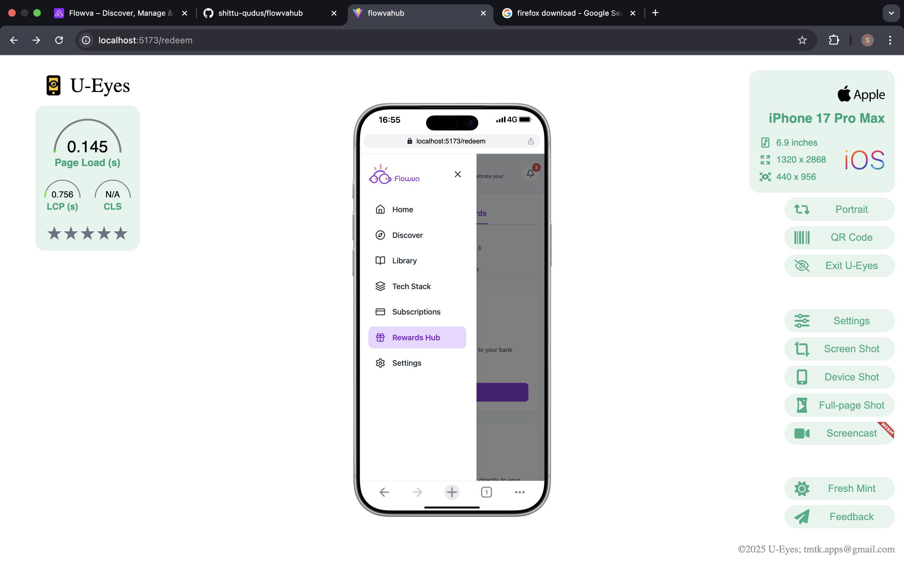
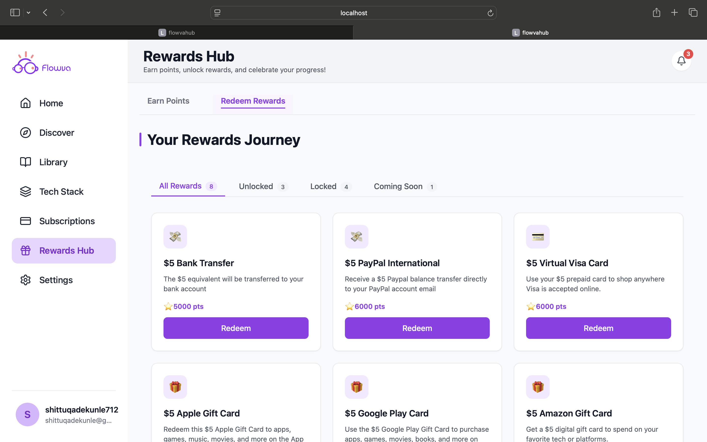
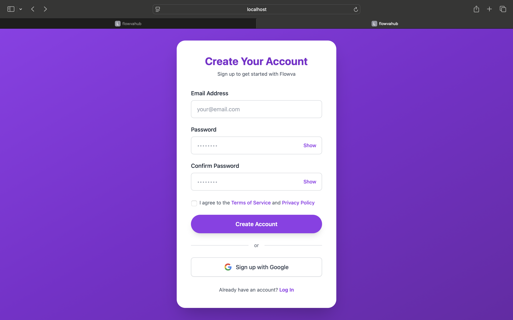

# FLOWVAHUB – Rewards Page (React + Supabase)

##  Project Overview

This project is a **technical assessment** for the **React Full-Stack Developer role** at **FlowvaHub**.

The task was to **recreate the Rewards page** of the FlowvaHub platform with **pixel-accurate UI**, **working business logic**, and **real Supabase integration** for authentication and data handling.

Live product reference:
 [https://www.flowvahub.com](https://www.flowvahub.com)

---

## Objectives

* Recreate the Rewards page UI as closely as possible
* Implement real authentication using Supabase
* Fetch and manage rewards data from Supabase
* Demonstrate clean architecture and scalable code structure
* Handle loading, empty, and error states properly

---

## Tech Stack

### Frontend

* **React** (TypeScript)
* **Tailwind CSS** for styling
* **React Router** for routing
- **Formik** for form state management
- **Yup** for schema-based form validation

### Backend / Database

* **Supabase**

  * Authentication
  * Database queries
  * API interaction handled directly via Supabase client

---

## Project Structure

```
src/
├── forms/              # Auth-related pages (signin, signup, forgot password)
├── hooks/              # Custom hooks (auth, data fetching)
│   └── useAuth.ts
├── lib/                # Core libraries
│   └── supabase.ts
├── services/           # Supabase logic & abstractions
│   ├── AuthService.ts
│   ├── SupabaseService.ts
│   ├── userService.ts
│   └── database.ts
├── types/              # TypeScript types
│   ├── auth.ts
│   └── supabase.ts
├── ui/                 # Reusable UI & page sections
│   ├── dashmain.tsx
│   ├── dashmaintwo.tsx
│   ├── header.tsx
│   └── redeemreward.tsx
├── utils/              # Helper utilities
├── App.tsx             # App entry
├── AuthGuard.tsx       # Protected route handling
├── dashboard.tsx       # Rewards dashboard page
├── sidebar.tsx         # Dashboard sidebar
└── main.tsx            # React bootstrap
```

---

##  Authentication

* Authentication is handled **directly via Supabase Auth**
* Supports:

  * Sign up
  * Sign in
  * Forgot password
  * Email confirmation
* **Google SMTP** is configured and used for email confirmation and auth-related emails
* Protected routes are enforced using an `AuthGuard` component

---

## Database & Data Handling

- Rewards data is stored and fetched from **Supabase tables**
- Queries are abstracted into service layers for clarity and maintainability
- Proper handling of:
  - Loading states
  - Empty states (no rewards available)
  - Error states (network, authentication, and database errors)
- Meaningful error feedback is surfaced in the UI to improve user experience

---

## UI & UX

- Layout and spacing closely match the FlowvaHub Rewards page
- Fully responsive design
- Modular UI components for scalability
- Clean separation between UI and business logic
- Naming consistency reviewed and maintained across components  
  (e.g. `dashmain`, `dashmaintwo`)
- Clear inline validation and error messaging for better usability

---

##  Screenshots

<div style="display: grid; grid-template-columns: repeat(2, 1fr); gap: 12px;">
  
  
  
  
</div>

---

## Live Deployment

* Deployed using **Vercel**
* Live URL: **<https://flowvahub.vercel.app/>**

---

## Setup Instructions

### 1️⃣ Clone the repository

```bash
git clone <https://github.com/shittu-qudus/flowvahub.git>
cd flowvahub
```

### 2️⃣ Install dependencies

```bash
npm install
```

### 3️⃣ Configure environment variables

Create a `.env.local` file:

```
VITE_SUPABASE_URL=your_supabase_project_url
VITE_SUPABASE_ANON_KEY=your_supabase_anon_key
```

### 4️⃣ Run the project

```bash
npm run dev
```

---

##  What This Project Demonstrates

* Strong React fundamentals
* Clean component and folder architecture
* Real-world Supabase usage (auth + database)
* Attention to UI detail
* Production-style code organization

---

##  Notes

* Backend logic is intentionally handled **only via Supabase**, as required
* The focus is on correctness, structure, and maintainability rather than over-engineering

---

## Author

**Shittu Qudus Adekunle**
Frontend Engineer (React / TypeScript / Supabase)

---

Thank you for reviewing this assessment. I look forward to discussing the implementation and decisions made in this project.

## FLOWVAHUB 